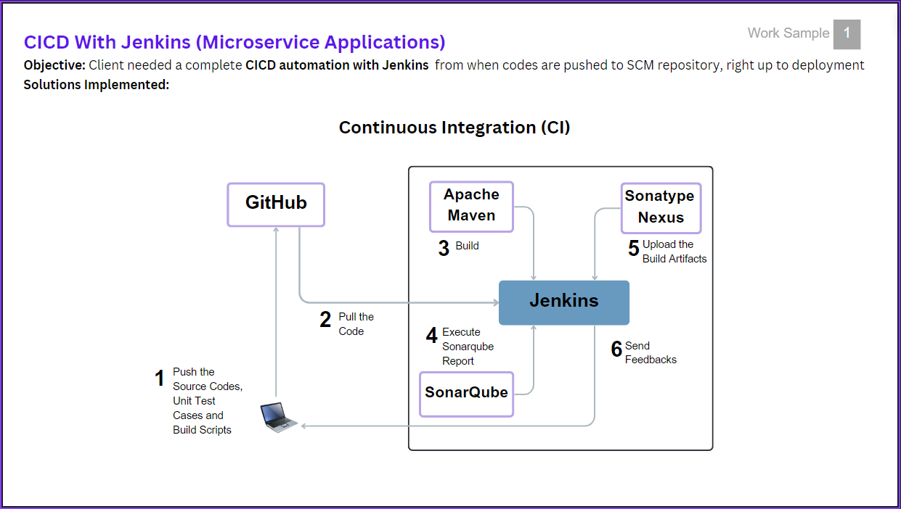
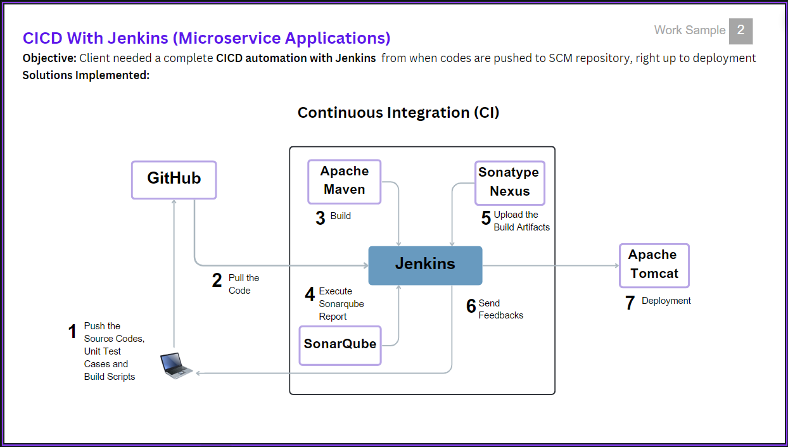
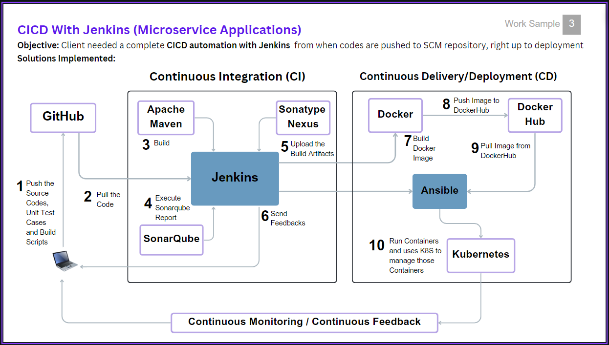
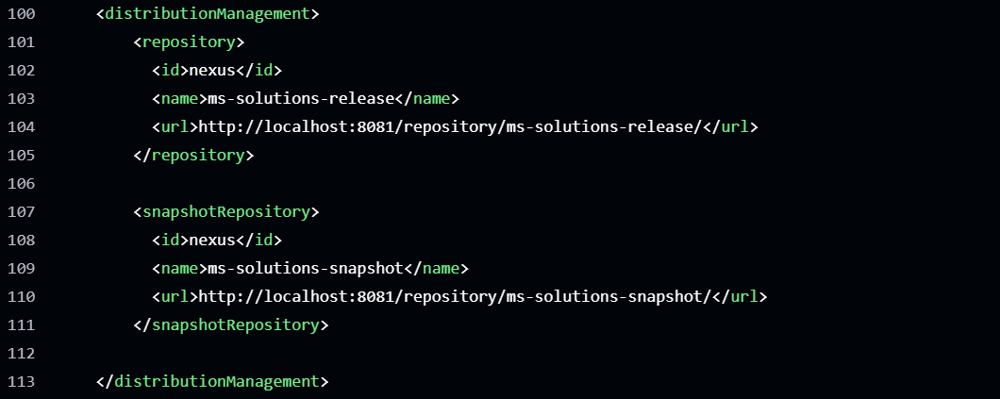

# CICD Project with Jenkins







## Install applications needed

### Install git

To install git, see [git install](https://git-scm.com/downloads)

**Configure git:**

```python
git config --global user.name "your-full-names"
```

```python
git config --global user.email "gitHubEmail"
```

Make sure to replace the username and email mwith your gitHube username and email

**Create an account with gitHub:**
To create an account in github, see [GitHub Account](https://github.com/)

### Tools to Install

- Jenkins
- Tomcat
- Docker
- SonarQube (as a Container)
- Nexus (as a Container)

### Tools Needed

- GitHub (git) = SCMT  
- Jenkins = (CICD)
- Maven = Build/Package 'Java applications'
- Sonarqube = Scan Codes
- Nexus = Backup our build artifact (optional)
- Tomcat = To host our application
- Docker = For containerization
- DockerHub = To backup our images  

## CICD Jenkins Integration

### Jenkins GitHub Intergrations

- In Jenkins, Go to `Dashboard` and create a new project `(+ New Item)`.
- Enter `jenkins project` name and select `Freestyle project` and click `OK`.
- Under `Github project/Project url`, paste your `Github Project URL`  
- Under `Source Code Management`, select `Git`.
- Copy the `GitHub Repository URL` and `paste` on Repository URL.
- Set your Credentials:
  - Under `Credentials`, select `+Add` then `Jenkins`.
  - Leave `Domain`, `Kind` and `Scope` as default.
  - Under `username`, input your `jenkins username` and `password`.
  - Under `ID`, input your `identifier`.
  - Input your description and select `Add`.
- Now Under `Credentials` replace `-none-` with your credentials.
- Under `Branches to build` input the branch you want to build from.
- Now `Save`
- Select `Build Now`

### Jenkins Maven Intergrations

Configure Maven:

- In Jenkins, `Dashboard` ==> `Manage Jenkins` ==> `Tools` ==> `Add Maven`
- Under Name, write maven+highest-version (eg: `maven3.9.7`)
- Now `Save`

Build with Maven:

- In Jenkins, Dashboard ==> `Project` ==> `Configure` ==> `Build Steps`
- Add `Build Step` ==> `Invoke-top-level Maven Targets`
- Under `Maven Version`, select your preconfigured maven version.
- Under `Goal` write `clean package`
- Now `Save`
- Select `Build Now`

### Jenkins SonarQube Intergrations (Code Quality)

On SonarQube:

Generate a Token:

- Go to `Administration` ==> Click the dropdown on `Security` ==> `Users`
- Click under 'Token'
- Enter Name under '`Name`', Chose Duration then click '`Generate`'
- Copy Token and Backup for you won't be able to see or copy it again.

| OR |

- Go to `Account` on the top right hand corner and click `My Account` then `Security`
- Fill the appropriate input and click '`Generate`'
- Under '`Type`', select '`Global Analysis Token`'
- Remember to backup your token

On Your project codes in GutHub or Wherever it is:

- Go to the Build Script (`pom.xml`) in the GitHub Repository
- Go to `Properties` and add/edit the following under `properties` tag:

```python
<sonar.host.url>your-sonarqube-url</sonar.host.url>
<sonar.login>your-username</sonar.login>
<sonar.password>your-password</sonar.password>
<sonar.projectKey>your-sonarqube-token</sonar.projectKey>
<sonar.projectName>your-project-name</sonar.projectName>
```

- `your-project-name`: This is what will appear in `SonarQube`
- Commit the changes.

On Jenkins:

Download and Install `SonarQube Plugins`:

- Dashboard ==> Manage Jenkins ==> `Plugins`
- `Available Plugins` ==> `SonarQube Scanner for Jenkins`
- Select and install without restart

Configure SonarQube:

- Dashboard ==> Manage Jenkins ==> System
- Scroll down to `SonarQube Servers` and click '`Add SonarQube`'
- Check '`Environmental Variables`'
- Input the following:
  - Name: your-name
  - Server URL: your server URL eg: `http://localhost:9000`
- Server authentication token:
  - Click the `+Add` button below ==> Jenkins
  - `Domain`: leave as it is
  - `Kind`: Secret text
  - `Scope`: leave as it is
  - `Secret`: your-sonarqube-token
  - `ID`: your-ID (eg: jenkins-sonar-cred)
  - `Description`: your-Description (eg: jenkins-sonar-cred)
- Then click '`Add`'
- Server authentication token:
- Select what you just created.
- Now '`Save`'

Run Your Job:

- Go to Dashboard ==> yourProject ==> Configure ==> Build Steps ==>
- Add Build Step ==> Invoke-top-level Maven Targets
- Under '`Maven Version`', select your preconfigured maven version.
- Under 'Goal' write '`sonar:sonar`'
- Then '`Save`'
- Build Now

### Jenkins Nexus Integration (Artifact Backup)

Configure Nexus:

Repositories:

- Sign in to nexus and click '`Server administration and configuration`'
- The `Server administration and configuration` is a gearlike symbol, which represents `Settings`
- Open Repository ==> `Create Repository` ==> `maven2 (hosted)`:
- Name: `your-repository-name`
- Version policy: `Release`
- Layout policy: `Strict`
- Content Disposition: `Inline`
- Blob store: `default`
- Deployment policy: `Allow redeploy`
- Click `Create repository`

- Repeat the same to create the second repository
- All the steps are the same but change the Version policy from `Release` to `Snapshot`

Configure pom.xml:

- Go to the pom.xml in your project
- Search for the `<distributionManagement>` tag
- It will look something like this:



 ```python
 <distributionManagement>
     <repository>
       <id>nexus</id>
       <name>your-release-repo-name</name>
       <url>nexus-release-url</url>
     </repository>
     
     <snapshotRepository>
       <id>nexus</id>
       <name>your-snapshot-repo-name</name>
       <url>nexus=snapshot-url</url>
     </snapshotRepository>     
 </distributionManagement>
 ```

- Under `id` : Put the repository name you created in nexus. Use the snapshot
- Under `name` : Place the same nexus snapshot repo name
- Under `url` : Place the snapshot url

Configure Jenkins:

- In Jenkins, go to Dashboard ==> Manage Jenkins ==> Plugins
- Available Plugins and search `Nexus Artifact Uploader`
- Install without restart

- Go to your project ==> Configure ==> Build Steps ==> Add build steps
- Nexus artifact uploader
  - Nexus Details:
  - Nexus Version: NEXUS3
  - Protocol: HTTP
  - Nexus UR: your nexus `URL` without the `http/https`: (eg: `localhost:8081`)
  - Credentials: use the user credentials you earlier configured in Nexus when configuring the `web application`
  - GroupId: your project name - what will appear in nexus (eg: `vin-app`)
  - Version: your version number (eg: `1.0-SNAPSHOT`)
  - Repository: The repository you created in Nexus (eg: `vin-app-snapshot`)
  - Artifacts ==> Add
    - ArtifactId: your ID. Subfolder inside your `'GroupId'` (Your project name version. eg: `vin-app-v1.0.0`)
    - Type: `war`
    - Classifier: leave blank
    - File: Get the complete link of your `.war file` on your backend.  
    - Default link could be found in: `/var/lib/jenkins/` (eg: /var/lib/jenkins/workspace/your-project-name/target/vin-app-v1.0.0.war)
  - Now Save
  - Build Now

To get your default jenkins directory:

- Go to Dashboard
- System

### Jenkins Tomcat Integrations

We do this intergration using a plugin call `Deploy to Container`  

- In Jenkins go to Dashboard ==> Manage Jenkins ==> Plugins ==>
- Available ==> Search `Deploy to container`
- Select and install without restart

- Dashboard ==> Project ==> Configure ==> Post-Build-Actions ==>
- Add `Post-Build-Action` ==> `Deploy war/ear to container`
- Under 'Deploy war/ear to a container'
  - WAR/EAR files:
    - `target/*.war`   | OR |
    - `target/your-built-artifact.war`
  - Context path: leave blank

- `Add Container` ==> Chose Tomcat Version (It should be the latest stable version):
  - Under Containers/Tomcat 9.x Remote
  - add new credentials
  - use your tomcat credentials that you will configure in the `tomcat-users.xml`
  - Use the following credential: `manager-gui,admin-gui,manager-script`
  - Follow the steps below to create your user in `tomcat-users.xml`

- To create your tomcat credentials:
  - On your terminal do the following:

```python
sudo nano /etc/tomcat9/tomcat-users.xml
```

Paste the following just above the </tomcat-users> closing tag:

```python
<user username="tomcat" password="admin123" roles="manager-gui,admin-gui"/>     
<user username="vin" password="admin123" roles="manager-gui,admin-gui,manager-script"/> 
```

**Note:**

- The `manager-gui,admin-gui` and the `manager-gui,admin-gui,manager-script` should not have the same username.
- Link to tomcat webapps: `/var/lib/tomcat9/webapps`
- Link to tomcat shutdown.sh: `/usr/share/tomcat9/bin/`

- Under Tomcat URL
- Copy and paste your Tomcat URL
- Save
- Build Now

### Email Notification

- In Jenkins go to Dashboard ==> Project ==> Configure ==> Post-Build-Action
- Add Post-Build-Action ==> `Email Notification` ==> `Emails`
- Insert the emails
- Save
- Build Now
- Note: This will send emails when a build fails, becomes unstable or returns to stable.  

### Configuring Projects in Jenkins

**General:**

Discard old builds:

- Days to keep builds: `you can leave blank`
- Max # of builds to keep: `Chose your number` (eg: 3)
- Save

**Build Triggers:**

We use build triggers to automate the build process instead to always click `Build Now`

Build Periodically:

- Jenkins uses a timer to trigger a build.
  - `* * * * *` Build every minute
  - `H * * * *` Build every hour. Best for Database backup

Poll SCM:

- Jenkins trigger a build based on changes in the source codes. (Generally Recommended)
- Jenkins pull the changes from GitHub.
- Cron Syntax:
  - `* * * * *`      # Check every Minute
  - `H/15 * * * *`   # Check every 15 minutes
  - `H * * * *`      # Check every Hour
  - `H H * * 5`      # Check every Specific Day of Week (Sun=0, Mon=1, Tue=2, Wed=3, Thu=4, Fri=5, Sat=6)
  - `H H 1 * *`      # Check every First Day of the Month
  
GitHub Web Hook:

- Jenkins do a build when there is any changes in the source code (GitHub Account)
- GitHub push the changes to Jenkins.  
- To configure = GitHub--> Project Repo--> Settings--> Webhooks-->  Add Webhook
  - `Content type = (application/json)`
  - `Payload URL = Paste the Jenkins URL with the extension github-webhook/`
  - (e.g. `http://18.218.211.120:8080/github-webhook/`)

**Build Environment:**

- Add timestamps to the Consol Output

## Jenkins Pipeline Jobs

- Dashboard ==> + New Item ==>
- Project Name ==> Pipeline ==> OK

- Configure Pipeline Jobs:

`Project Name` ==> `Configure`

**Genaral:**

Discard old builds:

- Strategy: Log Rotation
- Dayes to keep buiilds: (chose or leave blank for less than a day)
- Max 3 of builds to keep: (eg: 3)

GitHub project:

- Project url:
- `Copy and paste your gitHub project url`

- This project is parameterized:
  - Create parameter

- Build Triggers:
  - Poll SCM
  - Schedule: **** * (5 times with space)

**Pipeline:**  

- Defination:
  - Pipeline script

- Paste your groovy script
  - Pipeline script:
  - Check box of `Use Groovy Sandbox`
- Save
- Build Now
